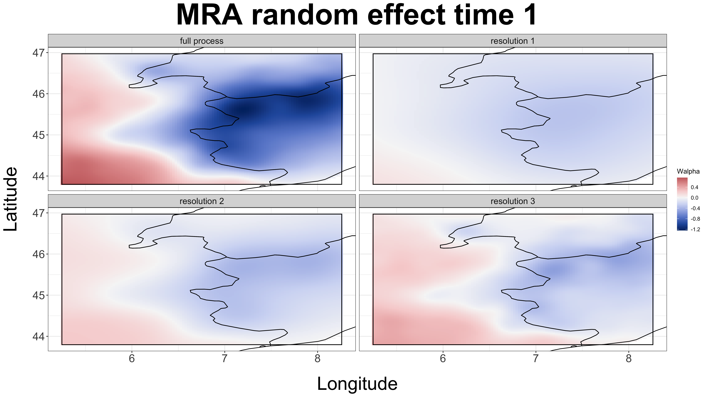

<!--                          -->
<!-- Turn off slide numbering -->
<!--                          -->

<style type="text/css">
slides > slide:not(.nobackground):after {
  content: '';
}
</style>
  
\newcommand{\bs}[1]{\boldsymbol{#1}}
\newcommand{\bm}[1]{\mathbf{#1}}
\newcommand{\oN}[1]{\operatorname{#1}}

<!-- To stop inf_mr, use:
servr::daemon_stop(1)
 -->
 
```{r setup, include=FALSE}
knitr::opts_chunk$set(echo = FALSE)
library(tidyverse)
library(knitr)
library(pgR)
library(mvnfast)
library(knitcitations)
```

```{r, echo=FALSE, message=FALSE}
biblio <- bibtex::read.bib("pg.bib")
# biblio <- bibtex::read.bib(here("2018", "mizzou", "mizzou", "mizzou.bib"))
```


<!-- ## Pollen is widely available across the globe -->

<!-- <center> -->
<!-- <video width="600" height="480" muted controls> -->
<!--   <source src="./pollen.mp4" type="video/mp4"> -->
<!-- </video> -->
<!-- </center> -->

# Southern Regional Council on Statistics Conference


## Overview

1) Spatio-temporal reconstruction of climate from pollen.
    a) Non-linear functional relationship.
        * Computationally challenging.
        * Non-linear and non-Gaussian relationships among data.
    
    b) Using data/parameter augmentation to improve computation.
    
2) Recursive Bayesian inference for latent spatial data.
    * Reducing computational cost through parallelization.
    * Better Markov Chain Monte Carlo (MCMC) mixing.


# Spatio-temporal reconstruction of climate from pollen

## Pollen is a unique paleoclimate proxy

- Globally distributed.

<hr style="height:18px; visibility:hidden;" />

- Trees are long-lived -- little evolutionary drift during the Holocene.

<hr style="height:18px; visibility:hidden;" />

- Current species distributions with respect to climate are well understood.

<hr style="height:18px; visibility:hidden;" />

- Many databases of pollen data.
    - [Neotoma](https://www.neotomadb.org/groups/category/pollen).
    - [European Pollen Database](http://www.europeanpollendatabase.net/index.php).
    - [Global Pollen Database](https://ecologicaldata.org/wiki/global-pollen-database).
    - [NOAA Pollen Database](https://www.ncdc.noaa.gov/data-access/paleoclimatology-data/datasets/pollen).


## Modeling goal

- Link the observed pollen counts to climate states during the modern period.

<hr style="height:24px; visibility:hidden;" />

- Use the learned relationship to predict unobserved climate state.

<hr style="height:24px; visibility:hidden;" />

- Generate climate histories that are local to the site of interest with uncertainty.

<hr style="height:160px; visibility:hidden;" />


<font size="3">
`r paste0(capture.output(print(biblio["tipton2019predicting"])), collapse = " ")`
</font>


## Setting the stage 

- Spatially explicit reconstructions of climate variables are important.

    <hr style="height:12px; visibility:hidden;" />

    - Many important ecological questions are local.
    
    <hr style="height:12px; visibility:hidden;" />

    - Predictions at all locations remove the effects of sampling bias in paleoclimate reconstruction.


<hr style="height:24px; visibility:hidden;" />

## Setting the stage 

- Prior work -- **4 pollen cores** and total compute time of approximately 28 hours.

    <hr style="height:24px; visibility:hidden;" />

- Currently: 363 sites:
    - non-linear response: compute time $\approx$ 48 hours.
    - P&oacute;lya-gamma linear response: compute time less than 2 hours.


<hr style="height:150px; visibility:hidden;" />

<font size="3">
`r paste0(capture.output(print(biblio["holmstrom2015bayesian"])), collapse = " ")`
</font>

---

```{r, fig.align='center', out.width = '100%'}
 
```

---

```{r, fig.align='center', out.width = '100%'}
# knitr::include_graphics("./images/pollen-sites.png") 
knitr::include_graphics("./images/all-sites.png") 
```

# Non-linear response model

## Data model 


* Sediment samples from a lake.

<hr style="height:18px; visibility:hidden;" />

* Take 1cm$^3$ cubes along the length of the sediment core.

<hr style="height:18px; visibility:hidden;" />

* In each cube, researcher counts the first $M$ pollen grains and identifies to species/OTU.

<hr style="height:18px; visibility:hidden;" />

* Raw data are counts of each species.

<hr style="height:18px; visibility:hidden;" />

- Compositional count data.

## Data Model

For the $i$th observation at location $\mathbf{s}$ and time $t$, 

<hr style="height:12px; visibility:hidden;" />

$$
\begin{align*}
\mathbf{y}_i \left( \mathbf{s}, t \right) & = \left( y_{i1} \left( \mathbf{s}, t \right), \ldots, y_{ij} \left( \mathbf{s}, t \right) \right)'
\end{align*}
$$

<hr style="height:122x; visibility:hidden;" />

is a $J$-dimensional compositional count observation.

<hr style="height:24px; visibility:hidden;" />

* $y_{ij} \left( \mathbf{s}, t \right)$ is the count of species $j$ in the $i$th sample at location $\mathbf{s}$ and time $t$.

## Data Model
$$
\begin{align*}
\mathbf{y}_i \left( \mathbf{s}, t \right) | \mathbf{p}\left( \mathbf{s}, t \right) & \sim \operatorname{Multinomial} \left( M_i \left( \mathbf{s}, t \right), \mathbf{p}\left( \mathbf{s}, t \right) \right).
\end{align*}
$$

<hr style="height:24px; visibility:hidden;" />

* $M_i \left( \mathbf{s}, t \right) = \sum_{j=1}^J y_{ij}\left( \mathbf{s}, t \right)$ is the total count observed (fixed and known) for observation $i$ at location $\mathbf{s}$ and time $t$.

<hr style="height:24px; visibility:hidden;" />

* Observation informative of the relative proportions $p_{j} \left( \mathbf{s}, t \right)$ only.

<hr style="height:24px; visibility:hidden;" />


## Data Model: Overdispersion

* The pollen data are highly variable and overdispersed.

    <hr style="height:12px; visibility:hidden;" />

* Mixture over a Dirichlet distribution. 

    <hr style="height:12px; visibility:hidden;" />

$$
\begin{align*}
\mathbf{p}\left( \mathbf{s}, t \right) | \boldsymbol{\alpha}\left( \mathbf{s}, t \right) & \sim \operatorname{Dirichlet} \left( \boldsymbol{\alpha}\left( \mathbf{s}, t \right) \right).
\end{align*}
$$

<hr style="height:24px; visibility:hidden;" />

* Marginalize out $\mathbf{p} \left( \mathbf{s}, t \right)$.

<hr style="height:24px; visibility:hidden;" />

$$
 \begin{align*}
\mathbf{y}_i\left( \mathbf{s}, t \right) | \boldsymbol{\alpha}\left( \mathbf{s}, t \right) & \sim \operatorname{Dirichlet-Multinomial} \left( M_i\left( \mathbf{s}, t \right), \boldsymbol{\alpha}\left( \mathbf{s}, t \right) \right).
\end{align*}
$$

<br />

## Data Model: Overdispersion

* Model the Dirichlet-multinomial random effect using the log link function:

<hr style="height:12px; visibility:hidden;" />

$$
\begin{align*}
\operatorname{log} \left( \boldsymbol{\alpha} \left( \mathbf{s}, t \right) \right) & = f \left( \mathbf{z}\left( \mathbf{s}, t \right) \right) \boldsymbol{\beta}.
\end{align*}
$$

<hr style="height:12px; visibility:hidden;" />

* $\mathbf{z}\left( \mathbf{s}, t \right)$' is a $q$-dimensional vector of climate variables. 

<hr style="height:24px; visibility:hidden;" />

* $f(\cdot)$ is some function of the climate state.

<hr style="height:24px; visibility:hidden;" />

* $\boldsymbol{\beta}$ is a $q \times J$ dimensional matrix of regression coefficients.
    
---

<hr style="height:8px; visibility:hidden;" />

```{r, out.width='100%', fig.align = 'center', echo=FALSE}
knitr::include_graphics(here::here("images", "alps-functional-fit-all-models-subset.png")) 
```

## Response Function

$$
\begin{align*}
\operatorname{log} \left( \boldsymbol{\alpha} \left( \mathbf{s}, t \right) \right) & = f \left( \mathbf{z}\left( \mathbf{s}, t \right) \right) \boldsymbol{\beta}.
\end{align*}
$$

<hr style="height:8px; visibility:hidden;" />

* $f \left( \mathbf{z}\left( \mathbf{s}, t \right) \right)$ is a basis expansion of the covariates $\mathbf{z}\left( \mathbf{s}, t \right)$.
    * Use B-splines or Gaussian Processes as a basis.
    * $\mathbf{z}\left( \mathbf{s}, t \right)$ is unknown for $t \neq 1$.  
    * Computationally challenging.

<hr style="height:60px; visibility:hidden;" />

<font size="3">
`r paste0(capture.output(print(biblio["tipton2019predicting"])), collapse = " ")`

<!-- <hr style="height:1px; visibility:hidden;" /> -->
`r paste0(capture.output(print(biblio["hefley2017basis"])), collapse = " ")`
</font>


## Calibration

* $\mathbf{z} \left( \mathbf{s}, t \right)$s are observed only at $t$ = 1.

<br />

* Calibration: Estimate $\boldsymbol{\beta}$ using:
$$
\begin{align*}
\mathbf{y} \left(1\right) & = \left( \mathbf{y} \left( \mathbf{s}_1, 1 \right), \ldots, \mathbf{y} \left( \mathbf{s}_n, 1 \right) \right)' \\
\mathbf{z} \left(1\right) & = \left( \mathbf{z} \left( \mathbf{s}_1, 1 \right), \ldots, \mathbf{z} \left( \mathbf{s}_n, 1 \right) \right)'.
\end{align*}
$$

<br />

* Reconstruction:
    * Use estimated $\boldsymbol{\beta}$s and fossil pollen $\mathbf{y} \left( t \right)$ to predict unobserved $\mathbf{z}\left( t \right)$.

<br />


## Dynamic Model

* For $\mathbf{z} \left(t \right) = \left( \mathbf{z} \left(\mathbf{s}_1, t \right)', \ldots,  \mathbf{z} \left(\mathbf{s}_n, t \right)' \right)$, we assume:

<hr style="height:8px; visibility:hidden;" />

$$
\begin{align*}
\mathbf{z} \left(t \right) - \mathbf{X} \left( t \right) \boldsymbol{\gamma} & = \mathbf{M}\left(t\right) \left( \mathbf{z} \left(t-1 \right) - \mathbf{X} \left( t \right) \boldsymbol{\gamma} \right) + \boldsymbol{\eta} \left(t \right).
\end{align*}
$$

<hr style="height:8px; visibility:hidden;" />

* $\mathbf{M}(t) = \rho \mathbf{I}_n$ is a propagator matrix.

* $\mathbf{X} \left(t \right) \boldsymbol{\gamma}$ are the fixed effects from covariates like latitude, elevation, etc.

* $\boldsymbol{\eta} \left( t \right) \sim \operatorname{N} \left( \mathbf{0}, \mathbf{R}\left( \boldsymbol{\theta} \right) \right)$.

* $\mathbf{R} \left( \boldsymbol{\theta} \right)$ is a Mátern spatial covariance matrix with parameters $\boldsymbol{\theta}$.

## Elevation 

```{r, out.width='95%', echo=FALSE}
knitr::include_graphics(here::here("images", "alps-elevation.png"))
```

## Scaling the process for big data

* Define a set of spatial knot locations $\mathbf{s}^{\star} = \left\{ \mathbf{s}_1^{\star}, \ldots, \mathbf{s}_m^{\star} \right\}$.

$$
\boldsymbol{\eta}^{\star} \left( t \right) \sim \operatorname{N} \left( \mathbf{0}, \mathbf{R}^{\star}\left( \boldsymbol{\theta} \right) \right).
$$


* $\mathbf{R}^{\star}\left( \boldsymbol{\theta} \right)$ is the spatial covariance defined at the knot locations $\mathbf{s}^{\star}$.


<hr style="height:200px; visibility:hidden;" />

<font size="3">
`r paste0(capture.output(print(biblio["banerjee2008gaussian"])), collapse = " ")`
</font>

## Predictive Process

* Linear interpolator from observed locations $\mathbf{s}$ to knot locations $\mathbf{s}_j^{\star}$ is 
$$
\mathbf{r} \left(\mathbf{s}, \mathbf{s}_j^{\star} \right) \mathbf{R}^{\star}\left( \boldsymbol{\theta} \right)^{-1},
$$
where $\mathbf{r} \left(\mathbf{s}, \mathbf{s}_j^{\star} \right) 
=  \operatorname{Cov} \left(\mathbf{s}, \mathbf{s}_j^{\star} \right)$.

* $\boldsymbol{\eta} \left( t \right) \approx \mathbf{r} \left(\mathbf{s}, \mathbf{s}^{\star} \right) \mathbf{R}^{\star}\left( \boldsymbol{\theta} \right)^{-1} \boldsymbol{\eta}^{\star} \left( t \right)$.

<hr style="height:6px; visibility:hidden;" />

* The dynamic climate process is approximated by

$$
\begin{align*}
\mathbf{z} \left(t \right) - \mathbf{X} \left( t \right) \boldsymbol{\gamma} & = \mathbf{M}\left(t\right) \left( \mathbf{z} \left(t-1 \right) - \mathbf{X} \left( t \right) \boldsymbol{\gamma} \right) + \mathbf{r} \left(\mathbf{s}, \mathbf{s}^{\star} \right) \mathbf{R}^{\star}\left( \boldsymbol{\theta} \right)^{-1} \boldsymbol{\eta}^{\star} \left(t \right).
\end{align*}
$$


<!-- ## Time Uncertainty -->

<!-- * Each fossil pollen observation includes estimates of time uncertainty. -->
<!--     * The time of the observation is uncertain. -->
<!--     * Weight the likelihoods according to age-depth model. -->
<!--     * Posterior distribution of ages. -->

<!-- <br /> -->

<!-- * For each observation fossil pollen observation an age-depth model gives a posterior distribution over dates. -->
<!--     * Define $\omega \left(\mathbf{s}, t \right)$ as P(age $\in (t-1, t)$).  -->
<!--     * $[\mathbf{y} \left( \mathbf{s}, t \right) | \boldsymbol{\alpha} \left( \mathbf{s}, t \right) ] = \prod_{t=1}^T [\mathbf{y} \left( \mathbf{s}, t \right) | \boldsymbol{\alpha} \left( \mathbf{s}, t \right)]^{\omega_\left(\mathbf{s}, t \right)}$. -->

# Implementation

## gitHub package

* Non-spatial code available in the gitHub package [BayesComposition](https://github.com/jtipton25/BayesComposition).


<br />

* Includes options for multiple models including:
    * mixture models.
    * different likelihoods and link functions.
    * correlations in functional response.

<br />

* Leverages code in `C++` using `Rcpp` package for computation speed.


## Computational Details

1) Fit the calibration model.

2) Use posterior distribution from stage (1) to generate predictions of climate independent in space and time.

3) Smooth the posterior distribution from stage (2) using dynamic linear model.

    * Use posterior mean estimates which does not fully quantify model uncertainty.

    * Goal: Use recursive Bayesian ideas from end of talk.
 

4) Fully Bayesian joint estimation.

<hr style="height:60px; visibility:hidden;" />

<font size="3">
`r paste0(capture.output(print(biblio["hooten2019prior"])), collapse = " ")`
</font>


## Estimation of $\mathbf{z} \left(\mathbf{s}, t \right)$

* High-dimensional spatio-temporal process.
    * Inefficient to sample with block Metropolis.
    * Poor mixing of MCMC chains.
    
<br />

* Non-linear transformation in the data model.
    * Difficult to use Kalman Filtering. 
    
<br />

* Particle Filtering Methods.
    * Difficult to implement, suffer from degeneracy.
    * Posterior can be multi-modal.
    
    
## Estimation of $\mathbf{z} \left(\mathbf{s}, t \right)$

* Elliptical Slice Sampling.
    * Assumes a Gaussian prior.
    * Requires no tuning.
    * Efficiently samples in high dimensions.
    * Easily explores multiple modes.

<hr style="height:12px; visibility:hidden;" />

* Adaptive block Metropolis within Gibbs and Elliptical Slice Sampling algorithms.

<hr style="height:12px; visibility:hidden;" />

* Highly multi-modal posterior is efficiently explored within the sampler.

<hr style="height:12px; visibility:hidden;" />

<font size="3">
`r paste0(capture.output(print(biblio["murray2010elliptical"])), collapse = " ")`
</font>

## Estimation of $\mathbf{z} \left(\mathbf{s}, t \right)$

* For Gaussian process expansion of $\mathbf{z} \left( \mathbf{s}, t \right)$:
    * The latent climate states are inputs into the covariance function.
    * Covariance input locations (and distance) are random.
    * Unique computational challenge.
        * Total computational cost is prohibitive $O(d \frac{(Tn)^3}{3})$.
    
* Proposed solution:
    * Predictive process representation.
    * Reduced computation cost $O(d T \frac{m^3}{3})$.
    
<!-- ## Elliptical Slice Sampling for DLMs -->

<hr style="height:12px; visibility:hidden;" />

<font size="3">
`r paste0(capture.output(print(biblio["tipton2019predicting"])), collapse = " ")`
</font>


## Reconstruction

```{r, out.width = "33%"}
knitr::include_graphics(c(
  here::here("images", "alps-predictions-mean-bspline.png"),
  here::here("images", "alps-predictions-anomalies-mean-bspline.png"),
  here::here("images", "alps-predictions-anomalies-sd-bspline.png")))
```


<!-- ```{r, eval=TRUE} -->
<!-- load("~/Google Drive/spatial-pollen/fit/fossil-prediction-elevation-nimble.RData") -->
<!-- load("~/Google Drive/spatial-pollen/fit/elevation-grid.RData") -->
<!-- N <- sqrt(nrow(Z_pred_full)) -->
<!-- tt <- ncol(Z_pred_full) -->
<!-- n_grid <- nrow(pred.grid) -->
<!-- ``` -->


<!-- ```{r} -->
<!-- Z_mean_full_mat <- Z_pred_full -->
<!-- for (t in 1:tt) { -->
<!--   Z_mean_full_mat[, t] <- Z_mean_full -->
<!-- } -->
<!-- dat_pred <- data.frame( -->
<!--   climate = c(Z_pred_full), -->
<!--   # climate = c(X_mean_full), -->
<!--   anomaly = c(Z_pred_full - Z_mean_full_mat) / sd(c(Z_pred_full - Z_mean_full_mat)), -->
<!--   long    = rep(pred.grid[, 1], times=tt), -->
<!--   lat     = rep(pred.grid[, 2], times=tt), -->
<!--   year    = rep(1:tt, each=n_grid) -->
<!-- ) -->
<!-- world <- map_data("world") # we already did this, but we can do it again -->
<!-- world <- subset(world, region %in% c("Italy", "Switzerland", "France")) -->
<!-- ``` -->


<!-- ```{r reconstruction, fig.show='animate', cache=TRUE, message=FALSE, warning=FALSE, interval = 0.5} -->
<!-- zlims <- range(dat_pred$climate) -->
<!-- alims <- range(dat_pred$anomaly)  -->
<!-- for (t in 1:tt) { -->
<!--   g_climate <- ggplot(data = subset(dat_pred, year==t), -->
<!--                       aes(x = long, y = lat, fill = climate)) + -->
<!--     geom_tile() + -->
<!--     # geom_point(data = dat_fossil_climate, aes(x = long, y = lat, fill=X, color=X), -->
<!--     #            size=0.25, alpha=1.0, inherit.aes=FALSE) + -->
<!--     # scale_fill_continuous(low = "blue", high = "red", limits=zlims) + -->
<!--     scale_fill_gradient2(low = "blue", mid="white", midpoint = sum(zlims)/2,  -->
<!--                          high = "red", limits=zlims) + -->
<!--         # scale_color_brewer(palette = "RdYlBu") + -->
<!--     geom_path(data = world, aes(x = long, y = lat, group = group), -->
<!--                  inherit.aes = FALSE, -->
<!--                  color = "black") + -->
<!--     coord_fixed(1.3) + -->
<!--     xlim(4.5, 9.5) +  -->
<!--     ylim(43.5, 47.5) +  -->
<!--     xlab("Longitude") + -->
<!--     ylab("Latitude") + -->
<!--     ggtitle(paste("Estimated climate for", 250 * (t-1), "to",  250 * t)) + -->
<!--     theme_bw() -->
<!--   g_anomaly <- ggplot(data = subset(dat_pred, year==t), -->
<!--                       aes(x = long, y = lat, fill = anomaly)) + -->
<!--     geom_tile() + -->
<!--     # geom_point(data = dat_fossil_climate, aes(x = long, y = lat, fill=X, color=X), -->
<!--     #            size=0.25, alpha=1.0, inherit.aes=FALSE) + -->
<!--     # scale_fill_continuous(low = "blue", high = "red", limits=alims) + -->
<!--     scale_fill_gradient2(low = "blue", mid = "white", midpoint = 0,  -->
<!--                          high = "red", limits = alims) + -->
<!--     # scale_color_continuous(pallette = "RdYlBu") +  -->
<!--     geom_path(data = world, aes(x = long, y = lat, group = group), -->
<!--                  inherit.aes = FALSE, -->
<!--                  color = "black") + -->
<!--     coord_fixed(1.3) + -->
<!--     xlim(4.5, 9.5) +  -->
<!--     ylim(43.5, 47.5) +  -->
<!--     xlab("Longitude") + -->
<!--     ylab("Latitude") + -->
<!--     ggtitle(paste("Estimated anomaly for", 250 * (t-1), "to",  250 * t)) + -->
<!--     theme_bw() -->
<!--   multiplot(g_climate, g_anomaly, cols=2) -->
<!--   # print(multiplot(g_climate, g_anomaly, cols=2)) -->
<!-- } -->
<!-- ``` -->

## Reconstruction over time


```{r, out.width = "100%"}
knitr::include_graphics(here::here("images", "alps-spatially-averaged-predictions.png")) 
```

<!-- ```{r, message=FALSE, warning=FALSE} -->
<!-- Z_post_mean <- apply(Z_post, c(2, 3), mean) -->
<!-- Z_post_lower_50 <- apply(apply(Z_post, c(1, 3), mean), 2, quantile, prob=0.25) -->
<!-- Z_post_upper_50 <- apply(apply(Z_post, c(1, 3), mean), 2, quantile, prob=0.75) -->
<!-- Z_post_lower_95 <- apply(apply(Z_post, c(1, 3), mean), 2, quantile, prob=0.025) -->
<!-- Z_post_upper_95 <- apply(apply(Z_post, c(1, 3), mean), 2, quantile, prob=0.975) -->

<!-- # dat <- data.frame( -->
<!-- #   Z        = c(apply(cbind(c(data$Z0 * sd_X + mu_X), Z_post_mean), 2, mean)), -->
<!-- #   lower_50 = c(NA, Z_post_lower_50), -->
<!-- #   upper_50 = c(NA, Z_post_upper_50), -->
<!-- #   lower_95 = c(NA, Z_post_lower_95), -->
<!-- #   upper_95 = c(NA, Z_post_upper_95), -->
<!-- #   year     = 0:tt*250) -->

<!-- dat <- data.frame( -->
<!--   year       = (0:tt)*250, -->
<!--   Z          = c(mean(data$Z0 * sd_X + mu_X), apply(Z_post_mean, 2, mean)), -->
<!--   # Z          = c(mean((data$Z0 - data$Wgamma) * sd_X + mu_X), apply(Z_post_mean, 2, mean)), -->
<!--   lower_50   = c(NA, apply(Z_post_mean, 2, mean) - -->
<!--     0.674 * apply(Z_post_mean, 2, sd) / sqrt(nrow(Z_post_mean))), -->
<!--   upper_50   = c(NA, apply(Z_post_mean, 2, mean) + -->
<!--     0.674 * apply(Z_post_mean, 2, sd) / sqrt(nrow(Z_post_mean))), -->
<!--   lower_95   = c(NA, apply(Z_post_mean, 2, mean) - -->
<!--     2 * apply(Z_post_mean, 2, sd) / sqrt(nrow(Z_post_mean))), -->
<!--   upper_95   = c(NA, apply(Z_post_mean, 2, mean) + -->
<!--     2 * apply(Z_post_mean, 2, sd) / sqrt(nrow(Z_post_mean)))) -->

<!-- ggplot(data = dat, aes(x=year, y=Z)) +  -->
<!--   geom_point(data = subset(dat, year == 0),  aes(x=year, y=Z), size=4) +  -->
<!--   geom_line(data = subset(dat, year > 0),  aes(x=year, y=Z), color = "red") +  -->
<!--   geom_ribbon(aes(ymin = lower_50, ymax = upper_50, fill = "red"), alpha = 0.5) + -->
<!--   geom_ribbon(aes(ymin = lower_95, ymax = upper_95, fill = "red"), alpha = 0.25) + -->
<!--   ggtitle("Climate Trend in degrees C") + -->
<!--   ylab("degrees C") + -->
<!--   xlab("years in the past") + -->
<!--   theme_bw() + -->
<!--   theme(legend.position = "none", -->
<!--         title = element_text(size=40),  -->
<!--         axis.title = element_text(size=26),  -->
<!--         axis.text = element_text(size=20))  -->
<!-- ``` -->


# Linear P&oacute;lya-gamma model

## Data model

$$\begin{align*}
\mathbf{y}(\mathbf{s}, t) & \sim \oN{Multinomial}(M(\mathbf{s}, t), \pi_{SB}(\boldsymbol{\eta}(\mathbf{s}, t))). 
\end{align*}$$

<hr style="height:24px; visibility:hidden;" />

- $\mathbf{y}(\mathbf{s}, t)$ is a $J$ dimensional vector of counts at site $\bm{s} \in \mathcal{D}$ and time $t \in \{1, \ldots, n_t\}$.

<hr style="height:24px; visibility:hidden;" />

- Link the underlying climate states to the probability of observing species $j$ through the latent variable $\eta_j(\bm{s}, t)$.
    
## Data model

- $\pi_{SB}(\boldsymbol{\eta}(\mathbf{s}, t))$ is a stick breaking transformation.

    <hr style="height:12px; visibility:hidden;" />
    
    - The map $\pi_{SB}: \mathcal{R}^{J-1} \rightarrow \Delta^{J}$ transforms the $J-1$ dimensional vector $\boldsymbol{\eta}(\mathbf{s}, t)$ to the $J$ dimensional unit simplex $\mathcal{\Delta}^{J}$.
    
<hr style="height:24px; visibility:hidden;" />

- Other maps to the unit simplex could be used (i.e., multi-logit), but the stick-breaking map reduces computational cost.

<hr style="height:24px; visibility:hidden;" />


## Data model (ignoring spatio-temporal indexing)

$$\begin{align*}
[\bm{y} | M, \pi_{SB}(\boldsymbol{\eta})] & =\oN{Multinomial}(\bm{y} | M, \pi_{SB}(\boldsymbol{\eta})) \\
& = \prod_{j=1}^{J-1} \oN{binomial}(y_j | M_j, \tilde{\pi}_j) \\
& = \prod_{j=}^{J-1} {M_j \choose y_j} \frac{(e^{\eta_j})^{y_j}}{(1 + e^{\eta_j})^{M_j} }.
\end{align*}$$

- $M_j = M - \sum_{k < j} M_k$.

<hr style="height:24px; visibility:hidden;" />
    
- Define the partial probabilities $\tilde{\pi}_j = \pi_{SB}(\boldsymbol{\eta})_j$ using the stick-breaking representation.

<hr style="height:8px; visibility:hidden;" />


## Data model (ignoring spatio-temporal indexing)

$$\begin{align*}
\frac{(e^{\eta_j})^{y_j}}{(1 + e^{\eta_j})^{M_j} } & = 2^{-M_j} e^{\kappa(y_j) \eta_j} \int_0^\infty e^{- \omega_j \eta_j^2 / 2 } [\omega_j | M_j, 0] \,d \omega.
\end{align*}$$

<hr style="height:24px; visibility:hidden;" />

- The integral identity is proportional to the product representation of the multinomial distribution.

<hr style="height:24px; visibility:hidden;" />

- The density $[\omega_j | M_j, 0]$ is a P&oacute;lya-gamma distribution.

<hr style="height:24px; visibility:hidden;" />

<font size="3">
`r paste0(capture.output(print(biblio["polson2013bayesian"])), collapse = " ")`

`r paste0(capture.output(print(biblio["linderman2015dependent"])), collapse = " ")`
</font>


## Data model (ignoring spatio-temporal indexing)

- With a prior $[\eta_j]$, joint density $[y_j, \eta_j]$ is 

<hr style="height:24px; visibility:hidden;" />

$$\begin{align*}
[y_j, \eta_j] & =  [\eta_j] {M_j \choose y_j} \frac{(e^{\eta_j})^{y_j}}{(1 + e^{\eta_j})^{M_j} }\\
& = \int_0^\infty   [\eta_j] {M_j \choose y_j} 2^{-M_j} e^{\kappa(y_j) \eta_j} e^{- \omega_j \eta_j^2 / 2 } [\omega_j | M_j, 0] \,d \omega,
\end{align*}$$

<hr style="height:24px; visibility:hidden;" />

where the integral defines a joint density over $[\eta_j, y_j, \omega_j]$.


## Data model

- Using this integral representation, we have

    $$\begin{align*}
    \omega_j | \eta_j, y_j & \sim \oN{PG( M_j, \eta_j)},
    \end{align*}$$
    
    which can be sampled using the exponential tilting property of the P&oacute;lya-gamma distribution. 

<hr style="height:24px; visibility:hidden;" />

- If $[\eta_j]$ is Gaussian, then $[\eta_j | \omega_j, y_j]$ is also Gaussian which enables conjugate sampling.

## Data model

- There is a cost:

    <hr style="height:12px; visibility:hidden;" />
    
    - Requires sampling the $\omega_j$s and these are computationally expensive.
    
    <hr style="height:12px; visibility:hidden;" />
    
    - However, these are also embarrassingly parallel.
    
    <hr style="height:12px; visibility:hidden;" />
    
    - Efficiently sampled using openMP parallelization.

<hr style="height:24px; visibility:hidden;" />
- For all examples tested so far with reduced-rank spatial processes, sampling P&oacute;lya-gamma random variables is the limiting computational cost.


<!--     ```{r} -->
<!--     J <- 4 -->
<!--     eta <- matrix(rnorm(5 * (J-1)), 5, J-1) -->
<!--     eta_to_pi(eta) -->
<!--     ``` -->

## Process model -- functional relationship
 

$$\begin{align*}
\eta_j(\bm{s}, t) = \color{blue}{\beta_{0j}} + \color{blue}{\beta_{1j}} \left( \bm{x}'(\bm{s}, t) \bs{\gamma} + \bm{w}'(\bm{s}) \bs{\alpha}(t) \right) + \color{blue}{\varepsilon(\bm{s}, t)}.
\end{align*}$$

<hr style="height:24px; visibility:hidden;" />

- $\color{blue}{\beta_{0j}}$ and $\color{blue}{\beta_{1j}}$ are regression coefficients with respect to the climate state $\bm{Z}(\bm{s}, t) = \left( \bm{x}'(\bm{s}, t) \bs{\gamma} + \bm{w}'(\bm{s}) \bs{\alpha}(t) \right)$.

<hr style="height:24px; visibility:hidden;" />

- $\color{blue}{\varepsilon(\bm{s}, t)} \stackrel{iid}{\sim} \oN{N}(0, \sigma^2_j)$ models overdispersion relative to the linear regression response.


---

```{r, fig.align='center', out.width = '100%'}

```

## Process model -- climate process 

$$\begin{align*}
\eta_j(\bm{s}, t) = \beta_{0j} + \beta_{1j} \left( \color{red}{\bm{x}'(\bm{s}, t) \bs{\gamma}} + \color{purple}{\bm{w}'(\bm{s}) \bs{\alpha}(t)} \right) + \varepsilon(\bm{s}, t).
\end{align*}$$

$\color{red}{\bm{X}(t) = \begin{pmatrix} \bm{x}'(\bm{s}_1, t) \\ \vdots \\ \bm{x}'(\bm{s}_n, t) \end{pmatrix}}$ are fixed covariates (elevation, latitude, etc.).

- We assume $\color{red}{\mathbf{X}(t) \equiv \mathbf{X}}$ for all $t$ although temporally varying covariates are possible (volcanic forcings, Milankovitch cycles, etc.).

- $\color{purple}{\bm{W} = \begin{pmatrix} \bm{w}'(\bm{s}_1) \\ \vdots \\ \bm{w}'(\bm{s}_n) \end{pmatrix}}$ are spatial basis functions with temporal random effects $\color{purple}{\boldsymbol{\alpha}(t)}$.

- $\mathbf{Z}_0 \sim \oN{N} (\color{red}{\bm{X}'(1) \bs{\gamma}} + \color{purple}{\bm{W} \bs{\alpha}(1)}, \sigma^2_0 \bm{I})$ is the observed modern climate state.

---

```{r, fig.align='center', out.width = '100%'}
knitr::include_graphics("./images/estimated-fixed-effects-fixed-mu.png") 
```

## Process model -- $\color{purple}{\mbox{random effects}}$  

- Challenge: scaling to 1000s of sites and 15,000 years ($\approx 60$ time increments).

<hr style="height:24px; visibility:hidden;" />

- Sparse, multiresolution representation with a dynamic linear model.

<hr style="height:24px; visibility:hidden;" />

$$\begin{align*}
\color{purple}{\bm{w}'(\bm{s}) \bs{\alpha}(t)} = \color{purple}{\sum_{m=1}^M \bm{w}_m'(\bm{s}) \bs{\alpha}_m(t)}.
\end{align*}$$

<hr style="height:24px; visibility:hidden;" />

- $\color{purple}{\bm{w}_m'(\bm{s})}$ is a Wendland basis over resolution $m$.

## Process model -- $\color{purple}{\mbox{random effects}}$  

<hr style="height:80px; visibility:hidden;" />

```{r, out.width = '50%', fig.show = 'hold'}
knitr::include_graphics(c("./images/MRA-grid.png", "./images/MRA-alpha-fixed-mu.png"))
```
 
<hr style="height:60px; visibility:hidden;" />


<font size="3">
`r paste0(capture.output(print(biblio["nychka2015multiresolution"])), collapse = " ")`
</font>

## Process model -- $\color{purple}{\mbox{random effects}}$  


$$\begin{align*}
\color{purple}{\bs{\alpha}_m(t)} & \sim \oN{N} \left( \bm{A}_m \color{purple}{\bs{\alpha}_m(t-1)}, \tau^2 \bm{Q}_m^{-1} \right).
\end{align*}$$

<hr style="height:24px; visibility:hidden;" />

- $\bm{A}_m$ is the propagator matrix (assume $\bm{A}_m \equiv \rho \bm{I}$ for all $m$).

<hr style="height:24px; visibility:hidden;" />

- $\bm{Q}_m$ is the precision matrix constructed from either a CAR or SAR process over the $m$th resolution.


---

```{r, fig.align='center', out.width = '100%'}
 
```

--- 

```{r, fig.align='center', out.width = '100%'}
knitr::include_graphics("./images/posterior-anomalies-maps-fixed-mu.png") 
```

---

```{r, fig.align='center', out.width = '100%'}
 
```

---

```{r, fig.align='center', out.width = '100%'}
 
```

---
 
```{r, fig.align='center', out.width = '100%'}
knitr::include_graphics("./images/spatial-averaged-predictions-fixed-mu.png") 
```


# Recursive Bayesian Inference for spatial and spatio-temporal models

## First order vs. second order representation

* Consider the Gaussian linear mixed model - first order (mean) representation:

$$
\begin{align*}
\mathbf{y} & = \mathbf{X} \boldsymbol{\beta} + \mathbf{Z} \boldsymbol{\alpha} + \boldsymbol{\varepsilon}.
\end{align*}
$$

* $\mathbf{X}$ is a set of fixed effect covariates.

<hr style="height:8px; visibility:hidden;" />

* $\boldsymbol{\beta}$ are regression coefficients.

<hr style="height:8px; visibility:hidden;" />

* $\mathbf{Z}$ is a set of random effect covariates and/or basis functions.

<hr style="height:8px; visibility:hidden;" />

* $\boldsymbol{\alpha} \sim \operatorname{N}(\mathbf{0}, \boldsymbol{\Sigma}_{\alpha})$ are random effects.

<hr style="height:8px; visibility:hidden;" />

* $\boldsymbol{\varepsilon} \sim \operatorname{N}(\mathbf{0}, \sigma^2 \mathbf{I})$.


## First order vs. second order representation

* First-order (mean) representation:

$$
\begin{align*}
\mathbf{y} & \sim \operatorname{N} \left(\mathbf{X} \boldsymbol{\beta} + \mathbf{Z} \boldsymbol{\alpha}, \sigma^2 \mathbf{I} \right), \\
\boldsymbol{\alpha} & \sim \operatorname{N} \left( \mathbf{0}, \boldsymbol{\Sigma}_{\alpha} \right), \\
\boldsymbol{\beta} & \sim \operatorname{N} \left( \mathbf{0}, \boldsymbol{\Sigma}_{\beta} \right).
\end{align*}
$$

* Second order (covariance) representation:

$$
\begin{align*}
\mathbf{y} & \sim \int \int \operatorname{N} \left(\mathbf{X} \boldsymbol{\beta} + \mathbf{Z} \boldsymbol{\alpha}, \sigma^2 \mathbf{I} \right) \operatorname{N} \left( \mathbf{0}, \boldsymbol{\Sigma}_{\alpha} \right) \operatorname{N} \left( \mathbf{0}, \boldsymbol{\Sigma}_{\beta} \right)  \, \mathrm{d} \boldsymbol{\alpha} \, \mathrm{d} \boldsymbol{\beta} \\ 
& \sim \operatorname{N} \left(\mathbf{0}, \sigma^2 \mathbf{I} +
\mathbf{Z} \boldsymbol{\Sigma}_{\alpha}\mathbf{Z'} + \mathbf{X} \boldsymbol{\Sigma}_\beta \mathbf{X}' \right).
\end{align*}
$$

## First order vs. second order representation

* For Gaussian models, this integration is standard practice -- improved mixing, convergence, and efficiency.

<hr style="height:8px; visibility:hidden;" />

* For non-Gaussian models, brute force or approximations are used.

    * Sample the latent $\boldsymbol{\alpha}$s and $\boldsymbol{\beta}$s directly.
    
    * Integrated nested Laplace approximations (INLA).

    * Replace the non-Gaussian likelihood by an approximating distribution that is Gaussian -- Variational Inference.

    * Conjugate recursive Bayesian inference.
 
 
<!-- ## Example: Linear Regression -->


<!-- $$ -->
<!-- \begin{align*} -->
<!-- \mathbf{y} & \sim \operatorname{N} \left(\mathbf{X} \boldsymbol{\beta}, \sigma^2 \mathbf{I} \right) \\ -->
<!-- \boldsymbol{\beta} & \sim \operatorname{N} \left( \mathbf{0}, \boldsymbol{\Sigma}_{\beta} \right) \\ -->
<!-- \sigma^2 & \sim \operatorname{Inverse-gamma} \left( \alpha_{\sigma^2}, \beta_{\sigma^2}\right) -->
<!-- \end{align*} -->
<!-- $$ -->

<!-- ## Example: Linear Regression -->

<!-- ```{r, cache = TRUE, echo = FALSE, out.width = "60%", fig.align="center"} -->
<!-- set.seed(101) -->
<!-- n <- 400  -->
<!-- X <- cbind(1, rnorm(n)) -->
<!-- beta <- c(1, 3) -->
<!-- sigma <- 0.75 -->
<!-- y <- rnorm(n, X %*% beta, sigma) -->

<!-- data.frame(y = y, X = X[, 2]) %>% -->
<!--   ggplot(aes(y = y, x = X)) + -->
<!--   geom_point() + -->
<!--   geom_abline(intercept = beta[1], slope = beta[2], color = "blue", lwd = 1.5) + -->
<!--   theme_bw() -->
<!-- ``` -->

<!-- ## Example: Linear Regression -->

<!-- * In this example, the analytic solution is known: -->

<!-- $$ -->
<!-- \begin{align*} -->
<!-- \boldsymbol{\beta} & \sim \operatorname{N} \left( \left( \boldsymbol{\Sigma}_{\beta}^{-1} + \frac{\mathbf{X}\mathbf{X}'}{\sigma^2} \right)^{-1} \left( \frac{\mathbf{X}' \mathbf{y}} {\sigma^2} \right), \left( \boldsymbol{\Sigma}_{\beta}^{-1} + \frac{\mathbf{X}\mathbf{X}'}{\sigma^2} \right)^{-1} \right) \\ -->
<!-- \sigma^2 & \sim \operatorname{Inverse-gamma} \left( \alpha_{\sigma^2} + \frac{n} {2}, \beta_{\sigma^2} + \frac{1}{2} \left( \mathbf{y} - \mathbf{X} \boldsymbol{\beta} \right)' \left( \mathbf{y} - \mathbf{X} \boldsymbol{\beta} \right) \right) -->
<!-- \end{align*}  -->
<!-- $$ -->

<!-- ## Example: Linear Regression  -->


<!-- $$ -->
<!-- \begin{align*} -->
<!-- \mathbf{y} & \sim \int \operatorname{N} \left(\mathbf{X} \boldsymbol{\beta}, \sigma^2 \mathbf{I} \right) \operatorname{N} \left( \mathbf{0}, \boldsymbol{\Sigma}_{\beta} \right) \, \mathrm{d} \boldsymbol{\beta}\\ -->
<!-- & \sim \operatorname{N} \left(\mathbf{0}, \sigma^2 \mathbf{I} + \mathbf{X} \boldsymbol{\Sigma}_\beta \mathbf{X}' \right)\\ -->
<!-- \sigma^2 & \sim \operatorname{Inverse-gamma} \left( \alpha_{\sigma^2}, \beta_{\sigma^2}\right) -->
<!-- \end{align*} -->
<!-- $$ -->


<!-- ## Example: Linear Regression -->

<!-- * Set up variables for a Gibbs sampler -->

<!-- ```{r, cache = TRUE, echo = TRUE, dependson = -1} -->
<!-- Sigma_beta <- 10 * diag(2) -->
<!-- K <- 1000 -->

<!-- ## initialize the variables -->
<!-- beta_fit   <- matrix(0, K, 2) -->
<!-- sigma2_fit <- rep(0, K) -->

<!-- ## initialize the first step in the algorithm -->
<!-- beta_fit[1, ] <- c(rmvn(1, rep(0, 2), Sigma_beta)) -->
<!-- sigma2_fit[1] <- 1 / rgamma(1, 1, 1) -->
<!-- ``` -->

<!-- ## Example: Linear Regression -->

<!-- * Run the Gibbs sampler -->

<!-- ```{r, cache = TRUE, echo = TRUE, dependson = c(-1, -2)} -->
<!-- start_gibbs <- Sys.time() -->
<!-- for (k in 2:K) { -->
<!--   beta_fit[k, ] <- rmvn( -->
<!--     1, -->
<!--     solve(t(X) %*% X / sigma2_fit[k-1] + solve(Sigma_beta)) %*% t(X) %*% y / sigma2_fit[k-1], -->
<!--     solve(t(X) %*% X / sigma2_fit[k-1] + solve(Sigma_beta)) -->
<!--   ) -->
<!--   sigma2_fit[k] <- 1 / rgamma( -->
<!--     1, -->
<!--     1 + n / 2, -->
<!--     1 + 0.5 * t(y - X %*% beta_fit[k, ]) %*% (y - X %*% beta_fit[k, ]) -->
<!--   ) -->
<!-- } -->
<!-- end_gibbs <- Sys.time() -->
<!-- ``` -->

<!-- ## Example: Linear Regression -->

<!-- * Examine the Gibbs sampler output -->

<!-- ```{r, cache = TRUE, dependson = c(-1, -2, -3)} -->
<!-- dat <- data.frame( -->
<!--   iteration = 1:K, -->
<!--   variable  = factor(rep(c("beta0", "beta1", "sigma2"), each = K)), -->
<!--   value     = c(c(beta_fit), sigma2_fit), -->
<!--   truth     = rep(c(beta, sigma^2), each = K) -->
<!-- ) -->

<!-- ggplot(data = dat, aes(x = iteration, y = value)) + -->
<!--   geom_line() + -->
<!--   geom_line(aes(x = iteration, y = truth), color = "red") + -->
<!--   facet_wrap(~ variable, ncol = 1, scales = "free") + -->
<!--   ggtitle("Gibbs sampler trace plots") + -->
<!--   theme( -->
<!--     plot.title = element_text(size = 42), -->
<!--     strip.text = element_text(size = 32), -->
<!--     axis.title = element_text(size = 22) -->
<!--   ) -->

<!-- ``` -->

<!-- ## Example: Linear Regression -->

<!-- * Examine the Gibbs sampler output post burn-in -->

<!-- ```{r, cache = TRUE, dependson = c(-1, -2, -3, -4)} -->
<!-- dat <- data.frame( -->
<!--   iteration = 1:(K/2), -->
<!--   variable  = factor(rep(c("beta0", "beta1", "sigma2"), each = K / 2)), -->
<!--   value     = c(c(beta_fit[(K / 2 + 1):K, ]), sigma2_fit[(K / 2 + 1):K]), -->
<!--   truth     = rep(c(beta, sigma^2), each = K / 2) -->
<!-- ) -->

<!-- ggplot(data = dat, aes(x = iteration, y = value)) + -->
<!--   geom_line() + -->
<!--   geom_line(aes(x = iteration, y = truth), color = "red") + -->
<!--   facet_wrap(~ variable, ncol = 1, scales = "free") + -->
<!--   ggtitle("Gibbs sampler trace plots") + -->
<!--   theme( -->
<!--     plot.title = element_text(size = 42), -->
<!--     strip.text = element_text(size = 32), -->
<!--     axis.title = element_text(size = 22) -->
<!--   ) -->

<!-- ``` -->

<!-- ## Example: Linear Regression -->

<!-- * Autocorrelation among samples -->

<!-- ```{r, cache = TRUE, dependson = c(-1, -2, -3, -5)} -->
<!-- df_acf <- dat %>% -->
<!--   group_by(variable) %>% -->
<!--   summarise(list_acf=list(acf(value, plot=FALSE))) %>% -->
<!--   mutate(acf_vals=purrr::map(list_acf, ~as.numeric(.x$acf))) %>% -->
<!--   select(-list_acf) %>% -->
<!--   unnest(cols = c(acf_vals)) %>% -->
<!--   group_by(variable) %>% -->
<!--   mutate(lag=row_number() - 1) -->

<!-- df_ci <- dat %>% -->
<!--   group_by(variable) %>% -->
<!--   summarise(ci = qnorm((1 + 0.95)/2)/sqrt(n())) -->

<!-- ggplot(df_acf, aes(x = lag, y = acf_vals)) + -->
<!--   geom_bar(stat = "identity", width=.05) + -->
<!--   geom_hline(yintercept = 0) + -->
<!--   geom_hline(data = df_ci, aes(yintercept = -ci), color = "blue", linetype = "dotted") + -->
<!--   geom_hline(data = df_ci, aes(yintercept = ci), color = "blue", linetype = "dotted") + -->
<!--   labs(x="Lag", y="ACF") + -->
<!--   facet_wrap(~variable) + -->
<!--   ggtitle("Gibbs Autocorrelation Function") -->

<!-- ``` -->

<!-- ```{r, cache = TRUE, dependson = c(-6:-1)} -->
<!-- ess_gibbs <- coda::effectiveSize(cbind(beta_fit, sigma2_fit)) -->
<!-- ess_gibbs -->
<!-- ``` -->

<!-- ## Metropolis-Hastings: sampler -->

<!-- ```{r, cache = TRUE, echo = FALSE, dependson = -7} -->
<!-- Sigma_beta <- 10 * diag(2) -->
<!-- K <- 1000 -->

<!-- ## initialize the variables -->
<!-- beta_fit   <- matrix(0, K, 2) -->
<!-- sigma2_fit <- rep(0, K) -->

<!-- ## initialize the first step in the algorithm -->
<!-- beta_fit[1, ] <- c(rmvn(1, rep(0, 2), Sigma_beta)) -->
<!-- sigma2_fit[1] <- 1 -->
<!-- ``` -->


<!-- ```{r, cache = TRUE, echo = TRUE, dependson = c(-1, -8), class.source = "small-code"} -->
<!-- start_MH <- Sys.time() -->
<!-- for (k in 2:K) { -->
<!--   beta_star <- beta_fit[k-1, ] + c(rmvn(1, rep(0, 2), 0.0025 * diag(2))) -->
<!--   mh1 <- sum(dnorm(y, X %*% beta_star, sqrt(sigma2_fit[k-1]), log = TRUE)) + -->
<!--     dmvn(beta_star, rep(0, 2), Sigma_beta, log = TRUE) -->
<!--   mh2 <- sum(dnorm(y, X %*% beta_fit[k-1, ], sqrt(sigma2_fit[k-1]), log = TRUE)) + -->
<!--     dmvn(beta_fit[k-1, ], rep(0, 2), Sigma_beta, log = TRUE) -->
<!--   if (exp(mh1 - mh2) > runif(1)) { -->
<!--     beta_fit[k, ] <- beta_star -->
<!--   } else { -->
<!--     beta_fit[k, ] <- beta_fit[k-1, ] -->
<!--   } -->

<!--   sigma2_star <- sigma2_fit[k-1] + rnorm(1, 0, 0.05) -->
<!--   if (sigma2_star > 0) { -->
<!--     mh1 <- sum(dnorm(y, X %*% beta, sqrt(sigma2_star), log = TRUE)) + -->
<!--       dgamma(1 / sigma2_star, 1, 1, log = TRUE) -->
<!--     mh2 <- sum(dnorm(y, X %*% beta, sqrt(sigma2_fit[k-1]), log = TRUE)) + -->
<!--       dgamma(1 / sigma2_fit[k-1], 1, 1, log = TRUE) -->
<!--     if (exp(mh1 - mh2) > runif(1)) { -->
<!--       sigma2_fit[k] <- sigma2_star -->
<!--     } else { -->
<!--       sigma2_fit[k] <- sigma2_fit[k-1] -->
<!--     } -->
<!--   } else { -->
<!--     sigma2_fit[k] <- sigma2_fit[k-1] -->
<!--   } -->
<!-- } -->
<!-- end_MH <- Sys.time() -->
<!-- ``` -->

<!-- ## Metropolis-Hastings: trace plots -->

<!-- ```{r, cache = TRUE, dependson = c(-2:-1, -9)} -->
<!-- dat <- data.frame( -->
<!--   iteration = 1:(K/2), -->
<!--   variable  = factor(rep(c("beta0", "beta1", "sigma2"), each = K / 2)), -->
<!--   value     = c(c(beta_fit[(K / 2 + 1):K, ]), sigma2_fit[(K / 2 + 1):K]), -->
<!--   truth     = rep(c(beta, sigma^2), each = K / 2) -->
<!-- ) -->

<!-- ggplot(data = dat, aes(x = iteration, y = value)) + -->
<!--   geom_line() + -->
<!--   geom_line(aes(x = iteration, y = truth), color = "red") + -->
<!--   facet_wrap(~ variable, ncol = 1, scales = "free") + -->
<!--   ggtitle("Metropolis-Hastings sampler trace plots") + -->
<!--   theme( -->
<!--     plot.title = element_text(size = 42), -->
<!--     strip.text = element_text(size = 32), -->
<!--     axis.title = element_text(size = 22) -->
<!--   ) -->

<!-- ``` -->

<!-- ## Metropolis-Hastings: autocorrelation function -->

<!-- ```{r, cache = TRUE, dependson = c(-3:-1, -10)} -->
<!-- df_acf <- dat %>% -->
<!--   group_by(variable) %>% -->
<!--   summarise(list_acf=list(acf(value, plot=FALSE))) %>% -->
<!--   mutate(acf_vals=purrr::map(list_acf, ~as.numeric(.x$acf))) %>% -->
<!--   select(-list_acf) %>% -->
<!--   unnest(cols = c(acf_vals)) %>% -->
<!--   group_by(variable) %>% -->
<!--   mutate(lag=row_number() - 1) -->

<!-- df_ci <- dat %>% -->
<!--   group_by(variable) %>% -->
<!--   summarise(ci = qnorm((1 + 0.95)/2)/sqrt(n())) -->

<!-- ggplot(df_acf, aes(x = lag, y = acf_vals)) + -->
<!--   geom_bar(stat = "identity", width=.05) + -->
<!--   geom_hline(yintercept = 0) + -->
<!--   geom_hline(data = df_ci, aes(yintercept = -ci), color = "blue", linetype = "dotted") + -->
<!--   geom_hline(data = df_ci, aes(yintercept = ci), color = "blue", linetype = "dotted") + -->
<!--   labs(x="Lag", y="ACF") + -->
<!--   facet_wrap(~variable) + -->
<!--   ggtitle("Metropolis-Hastings Autocorrelation Function") -->

<!-- ess_MH <- coda::effectiveSize(cbind(beta_fit, sigma2_fit)) -->
<!-- ``` -->


<!-- ## Integrated Metropolis-Hastings sampler: Sherman Morrison Woodbury -->

<!-- * Requires evaluation of the normal density with covariance matrix $\sigma^2 \mathbf{I} + \mathbf{X} \boldsymbol{\Sigma}_\beta \mathbf{X}'$ where the evaluation of the multivariate normal distribution requires the matrix inverse -->

<!-- $$ -->
<!-- \begin{align*}\left( \sigma^2 \mathbf{I} + \mathbf{X} \boldsymbol{\Sigma}_\beta \mathbf{X}' \right)^{-1} & = \left( \sigma^2 \mathbf{I} \right)^{-1} - \left( \sigma^2 \mathbf{I} \right)^{-1} \mathbf{X} \left( \boldsymbol{\Sigma}_{\beta}^{-1} + \mathbf{X}' \left( \sigma^2 \mathbf{I} \right)^{-1} \mathbf{X} \right)^{-1} \mathbf{X}' \left( \sigma^2 \mathbf{I} \right)^{-1} \\ -->
<!-- & = \frac{1}{\sigma^2} \mathbf{I} - \frac{1}{\sigma^2} \mathbf{X} \left( \boldsymbol{\Sigma}_{\beta}^{-1} + \frac{1}{\sigma^2} \mathbf{X}' \mathbf{X} \right)^{-1} \mathbf{X}'\frac{1}{\sigma^2} \\ -->
<!-- & = \frac{1}{\sigma^2} \left( \mathbf{I} - \mathbf{X} \left( \sigma^2 \boldsymbol{\Sigma}_{\beta}^{-1} + \mathbf{X}' \mathbf{X} \right)^{-1} \mathbf{X}' \right) \\ -->
<!-- \end{align*} -->
<!-- $$ -->

<!-- using the Sherman Morrison Woodbury equation (see [here](https://en.wikipedia.org/wiki/Sherman%E2%80%93Morrison_formula),  [here](https://en.wikipedia.org/wiki/Woodbury_matrix_identity), and [here](https://en.wikipedia.org/wiki/Matrix_determinant_lemma)) -->

<!-- ## Integrated Metropolis-Hastings sampler: Sherman Morrison Woodbury -->

<!-- ```{r, echo = TRUE, class.source = "small-code"} -->
<!-- dmvn_smw <- function(y, X, tX, tXX, sigma2, Sigma_beta, log = TRUE) { -->
<!--   Sigma_beta_inv <- solve(Sigma_beta) -->
<!--   n <- length(y) -->
<!--   ## calculate the Sherman-Morrison-Woodbury inverse -->
<!--   Sigma_inv <- 1 / sigma2 * I - 1 / sigma2 * X %*% solve(Sigma_beta_inv + tXX / sigma2) %*% tX / sigma2 -->
<!--     ## calculate the Sherman-Morrison-Woodbury determinant -->
<!--   Sigma_det <- determinant(Sigma_beta_inv + tXX / sigma2, logartithm = TRUE)$modulus[1] + -->
<!--     determinant(Sigma_beta, logartithm = TRUE)$modulus[1] + -->
<!--     n * log(sigma2) -->

<!--   ll <- c( - 0.5 * n * log(2 * base::pi) - 0.5 * Sigma_det - 0.5 * sum(y * (Sigma_inv %*% y))) -->
<!--   if (log) { -->
<!--     return(ll) -->
<!--   } else { -->
<!--     return(exp(ll)) -->
<!--   } -->
<!-- } -->
<!-- ``` -->

<!-- ## Integrated Metropolis-Hastings sampler -->

<!-- ```{r, cache = TRUE, echo = FALSE, dependson = -12} -->
<!-- Sigma_beta <- 10 * diag(2) -->
<!-- K <- 1000 -->

<!-- ## initialize the variables -->
<!-- sigma2_fit <- rep(0, K) -->

<!-- ## initialize the first step in the algorithm -->
<!-- sigma2_fit[1] <- 1 -->
<!-- ``` -->

<!-- ```{r, cache = TRUE, echo = TRUE, dependson = c(-1, -13), class.source = "small-code"} -->
<!-- tX <- t(X) -->
<!-- tXX <- tX %*% X -->
<!-- n <- length(y) -->
<!-- I <- diag(n) -->

<!-- start_MH_integrated <- Sys.time() -->
<!-- for (k in 2:K) { -->
<!--   sigma2_star <- sigma2_fit[k-1] + rnorm(1, 0, 0.15) -->
<!--   if (sigma2_star > 0) { -->
<!--     mh1 <- dmvn_smw(y, X, tX, tXX, sigma2_star, Sigma_beta, log = TRUE) + -->
<!--       dgamma(1 / sigma2_star, 1, 1, log = TRUE) -->
<!--     mh2 <- dmvn_smw(y, X, tX, tXX, sigma2_fit[k-1], Sigma_beta, log = TRUE) + -->
<!--       dgamma(1 / sigma2_fit[k-1], 1, 1, log = TRUE) -->
<!--     if (exp(mh1 - mh2) > runif(1)) { -->
<!--       sigma2_fit[k] <- sigma2_star -->
<!--     } else { -->
<!--       sigma2_fit[k] <- sigma2_fit[k-1] -->
<!--     } -->
<!--   } else { -->
<!--     sigma2_fit[k] <- sigma2_fit[k-1] -->
<!--   } -->
<!-- } -->
<!-- ## recover the betas using composition sampling -->
<!-- beta_fit   <- matrix(0, K, 2) -->
<!-- for (k in 1:K) { -->
<!--   beta_fit[k, ] <- c(rmvn(1, -->
<!--                           solve(t(X) %*% X / sigma2_fit[k] + Sigma_beta) %*% t(X) %*% y / sigma2_fit[k], -->
<!--                           solve(t(X) %*% X / sigma2_fit[k] + Sigma_beta))) -->
<!-- } -->
<!-- end_MH_integrated <- Sys.time() -->
<!-- ``` -->

<!-- ## Integrated M-H sampler: trace plots -->


<!-- ```{r, cache = TRUE, dependson = c(-2:-1, -14)} -->
<!-- dat <- data.frame( -->
<!--   iteration = 1:(K/2), -->
<!--   variable  = factor(rep(c("beta0", "beta1", "sigma2"), each = K / 2)), -->
<!--   value     = c(c(beta_fit[(K / 2 + 1):K, ]), sigma2_fit[(K / 2 + 1):K]), -->
<!--   truth     = rep(c(beta, sigma^2), each = K / 2) -->
<!-- ) -->

<!-- ggplot(data = dat, aes(x = iteration, y = value)) + -->
<!--   geom_line() + -->
<!--   geom_line(aes(x = iteration, y = truth), color = "red") + -->
<!--   facet_wrap(~ variable, ncol = 1, scales = "free") + -->
<!--   ggtitle("Integrated MH sampler trace plots") + -->
<!--   theme( -->
<!--     plot.title = element_text(size = 42), -->
<!--     strip.text = element_text(size = 32), -->
<!--     axis.title = element_text(size = 22) -->
<!--   ) -->

<!-- ``` -->

<!-- ## Integrated M-H sampler: ACF plots -->

<!-- ```{r, cache = TRUE, dependson = c(-3:-1, -15)} -->
<!-- df_acf <- dat %>% -->
<!--   group_by(variable) %>% -->
<!--   summarise(list_acf=list(acf(value, plot=FALSE))) %>% -->
<!--   mutate(acf_vals=purrr::map(list_acf, ~as.numeric(.x$acf))) %>% -->
<!--   select(-list_acf) %>% -->
<!--   unnest(cols = c(acf_vals)) %>% -->
<!--   group_by(variable) %>% -->
<!--   mutate(lag=row_number() - 1) -->

<!-- df_ci <- dat %>% -->
<!--   group_by(variable) %>% -->
<!--   summarise(ci = qnorm((1 + 0.95)/2)/sqrt(n())) -->

<!-- ggplot(df_acf, aes(x = lag, y = acf_vals)) + -->
<!--   geom_bar(stat = "identity", width=.05) + -->
<!--   geom_hline(yintercept = 0) + -->
<!--   geom_hline(data = df_ci, aes(yintercept = -ci), color = "blue", linetype = "dotted") + -->
<!--   geom_hline(data = df_ci, aes(yintercept = ci), color = "blue", linetype = "dotted") + -->
<!--   labs(x="Lag", y="ACF") + -->
<!--   facet_wrap(~variable) + -->
<!--   ggtitle("Integrated Metropolis-Hastings Autocorrelation Function") -->

<!-- ess_MH_integrated <- coda::effectiveSize(cbind(beta_fit, sigma2_fit)) -->
<!-- ``` -->

<!-- ## Linear Regression: Effective Sample sizes -->

<!-- ```{r} -->
<!-- ess_beta_0 <- matrix( -->
<!--   c( -->
<!--     ess_gibbs[1], -->
<!--     ess_MH[1], -->
<!--     ess_MH_integrated[1]#, -->
<!--     # ess_gibbs[1] / as.double(end_gibbs - start_gibbs, units = "secs"), -->
<!--     # ess_MH[1] / as.double(end_MH - start_MH, units = "secs"), -->
<!--     # ess_MH_integrated[1] / as.double(end_MH_integrated - start_MH_integrated, units = "secs") -->
<!--   ), -->
<!--   3, 1 -->
<!--   # 3, 2 -->
<!-- ) -->

<!-- ess_beta_1 <- matrix( -->
<!--   c( -->
<!--     ess_gibbs[2], -->
<!--     ess_MH[2], -->
<!--     ess_MH_integrated[2]#,  -->
<!--     # ess_gibbs[2] / as.double(end_gibbs - start_gibbs, units = "secs"), -->
<!--     # ess_MH[2] / as.double(end_MH - start_MH, units = "secs"), -->
<!--     # ess_MH_integrated[2] / as.double(end_MH_integrated - start_MH_integrated, units = "secs") -->
<!--   ), -->
<!--   3, 1 -->
<!--   # 3, 2 -->
<!-- ) -->

<!-- ess_sigma2 <- matrix( -->
<!--   c( -->
<!--     ess_gibbs[3], -->
<!--     ess_MH[3], -->
<!--     ess_MH_integrated[3]#, -->
<!--     # ess_gibbs[3] / as.double(end_gibbs - start_gibbs, units = "secs"), -->
<!--     # ess_MH[3] / as.double(end_MH - start_MH, units = "secs"), -->
<!--     # ess_MH_integrated[3] / as.double(end_MH_integrated - start_MH_integrated, units = "secs") -->
<!--   ), -->
<!--   3, 1 -->
<!--   # 3, 2 -->
<!-- ) -->

<!-- rownames(ess_beta_0) <- c("Gibbs", "MH", "Integrated MH") -->
<!-- # colnames(ess_beta_0) <- c("ESS") -->
<!-- # colnames(ess_beta_0) <- c("ESS", "ESS per second") -->
<!-- rownames(ess_beta_1) <- c("Gibbs", "MH", "Integrated MH") -->
<!-- # colnames(ess_beta_1) <- c("ESS") -->
<!-- # colnames(ess_beta_1) <- c("ESS", "ESS per second") -->
<!-- rownames(ess_sigma2) <- c("Gibbs", "MH", "Integrated MH") -->
<!-- # colnames(ess_sigma2) <- c("ESS") -->
<!-- # colnames(ess_sigma2) <- c("ESS", "ESS per second") -->

<!-- dat <- cbind(ess_beta_0, ess_beta_1, ess_sigma2) -->
<!-- colnames(dat) <- c("$\\beta_0$", "$\\beta_1$", "$\\sigma^2$") -->
<!-- dat %>% -->
<!--   kableExtra::kable(digits = 0, format = "markdown") #%>% -->
<!--   # kableExtra::add_header_above(c("Algorithm", "$\\beta_0$", "$\\beta_1$", "$\\sigma^2$"))# %>% -->
<!--   # kableExtra::add_header_above(c("Algorithm", "$\\beta_0$" = 2, "$\\beta_1$" = 2, "$\\sigma^2$" = 2)) %>% -->
<!--   # kableExtra::kable_styling("striped") -->
<!-- ``` -->


<!-- ## Example: spatial regression model -->

<!-- $$ -->
<!-- \begin{align*} -->
<!-- y \left( \mathbf{s} \right) & = \mathbf{X} \left( \mathbf{s} \right) \boldsymbol{\beta} + \eta \left( \mathbf{s} \right) + \varepsilon \left( \mathbf{s} \right), \\ -->
<!-- \boldsymbol{\eta} & \sim \operatorname{N} \left( \mathbf{0}, \mathbf{C} \right). -->
<!-- \end{align*} -->
<!-- $$ -->

<!-- * $\boldsymbol{\eta} = \left( \eta \left( \mathbf{s}_1 \right), \ldots, \eta \left( \mathbf{s}_n \right) \right)'$. -->

<!-- <hr style="height:8px; visibility:hidden;" /> -->

<!-- * Spatial location index $\mathbf{s}$. -->

<!-- <hr style="height:8px; visibility:hidden;" /> -->

<!-- * $\mathbf{C}\left( \cdot, \cdot \right)$ is a [spatial covariance function](https://en.wikipedia.org/wiki/Covariance_function).  -->

<!-- <hr style="height:8px; visibility:hidden;" /> -->

<!-- * $\mathbf{C}$ is a spatial covariance matrix with $ij$th entry $\mathbf{C}_{ij} = \mathbf{C}\left( \mathbf{s}_i, \mathbf{s}_j \right)$. -->

<!-- <hr style="height:8px; visibility:hidden;" /> -->

<!-- * Observations nearby are more correlated than observations further away -- [Toblers first law of geography](https://en.wikipedia.org/wiki/Tobler%27s_first_law_of_geography). -->

<!-- ## Example: spatial regression model -->

<!-- * Let $\mathbf{Z}$ be a set of spatial basis functions where $\mathbf{Z} \mathbf{Z}' = \mathbf{C}$. -->

<!-- $$ -->
<!-- \begin{align*} -->
<!-- y \left( \mathbf{s} \right) & = \mathbf{X} \left( \mathbf{s} \right) \boldsymbol{\beta} + \eta \left( \mathbf{s} \right) + \varepsilon \left( \mathbf{s} \right) \\ -->
<!-- & = \mathbf{X} \left( \mathbf{s} \right) \boldsymbol{\beta} + \mathbf{Z} \left( \mathbf{s} \right) \boldsymbol{\alpha} + \varepsilon \left( \mathbf{s} \right). -->
<!-- \end{align*} -->
<!-- $$ -->

<!-- <hr style="height:8px; visibility:hidden;" /> -->

<!-- * $\mathbf{Z}$ can be chosen to provide fast computation, reduced-rank computation, or other properties of interest if you use the approximation $\mathbf{Z} \boldsymbol{\Sigma}_{\alpha} \mathbf{Z}' \approx \mathbf{C}$. -->

<!-- ## Example: spatial regression model -->

<!-- * Let $\mathbf{C} = \mathbf{U} \mathbf{D} \mathbf{U}'$ be an eigen-decomposition. Then setting $\mathbf{Z}= \mathbf{U}$ and $\boldsymbol{\alpha} \sim \operatorname{N} \left( \mathbf{0}, \mathbf{D} \right)$ gives an equivalent model -->

<!-- $$ -->
<!-- \begin{align*} -->
<!-- \mathbf{y} & = \int \operatorname{N} \left( \mathbf{X} \boldsymbol{\beta} + \mathbf{U} \boldsymbol{\alpha}, \sigma^2 \mathbf{I} \right) \operatorname{N} \left( \mathbf{0}, \boldsymbol{D} \right) \, \mathrm{d} \boldsymbol{\alpha}  \\ -->
<!-- & = \operatorname{N} \left( \mathbf{X} \boldsymbol{\beta}, \sigma^2 \mathbf{I} + \mathbf{U} \mathbf{D} \mathbf{U}' \right) \\ -->
<!-- & = \operatorname{N} \left( \mathbf{X} \boldsymbol{\beta}, \sigma^2 \mathbf{I} + \mathbf{C} \right). -->
<!-- \end{align*} -->
<!-- $$ -->

<!-- ## Example: spatial regression: Simulated data -->

<!-- ```{r, cache = TRUE, echo = TRUE, class.source = "small-code"} -->
<!-- set.seed(404) -->
<!-- correlation_function <- function(D, theta) { -->
<!--     ## calculate the Matern correlation using parameters theta on the log scale -->
<!--     geoR::matern(D, exp(theta[1]), exp(theta[2])) -->
<!-- } -->

<!-- n    <- 40 -->
<!-- locs <- expand.grid( -->
<!--   seq(0, 1, length.out = n), -->
<!--   seq(0, 1, length.out = n) -->
<!-- ) -->

<!-- D      <- fields::rdist(locs) -->
<!-- theta  <- c(log(1.01), log(0.5)) -->
<!-- tau2   <- 1.5 -->
<!-- sigma2 <- 0.25 -->
<!-- Sigma  <- tau2 * correlation_function(D, theta) -->
<!-- eta    <- c(rmvn(1, rep(0, n^2), Sigma)) -->
<!-- y      <- eta + rnorm(n^2, 0, sqrt(sigma2)) -->
<!-- ``` -->

<!-- ## Example: spatial regression -->

<!-- ```{r, cache = TRUE, out.width = "80%", fig.align = "center"} -->
<!-- layout(matrix(1:2, 1, 2)) -->
<!-- fields::image.plot(matrix(y, n, n), main = list("observed data", cex = 3)) -->
<!-- fields::image.plot(matrix(eta, n, n), main = list("latent spatial process", cex = 3)) -->
<!-- ``` -->

<!-- ## Example: spatial regression  -->

<!-- ```{r, cache = TRUE, echo = TRUE, out.width = "65%", class.source = "small-code", eval = FALSE} -->
<!-- eigen_Sigma <- eigen(Sigma, symmetric = TRUE) -->
<!-- U           <- eigen_Sigma$vectors -->
<!-- D           <- diag(eigen_Sigma$values) -->
<!-- alpha_hat <- D %*% (t(U) %*% (solve(sigma2 * diag(n^2) + Sigma) %*% y)) -->

<!-- layout(matrix(1:2, 1, 2)) -->
<!-- fields::image.plot(matrix(eta, n, n), main = list("2nd-order spatial process", cex = 3)) -->
<!-- fields::image.plot(matrix(U %*% alpha_hat, n, n), main = list("1st-order spatial process", cex = 3)) -->
<!-- ``` -->


<!-- ```{r, cache = TRUE, out.width = "70%"} -->
<!-- eigen_Sigma <- eigen(Sigma, symmetric = TRUE) -->
<!-- U         <- eigen_Sigma$vectors -->
<!-- D         <- diag(eigen_Sigma$values) -->
<!-- alpha_hat <- D %*% (t(U) %*% (solve(sigma2 * diag(n^2) + Sigma) %*% y)) -->

<!-- layout(matrix(1:2, 1, 2)) -->
<!-- fields::image.plot(matrix(eta, n, n), main = list("2nd-order spatial process", cex = 3)) -->
<!-- fields::image.plot(matrix(U %*% alpha_hat, n, n), main = list("1st-order spatial process", cex = 3)) -->
<!-- ``` -->

<!-- ## Example: spatial regression  -->

<!-- * Can truncate of the leading eigenvectors and eigenvalues to get $\mathbf{Z} = \mathbf{\tilde{U}}$ and $\tilde{\boldsymbol{\alpha}} \sim \operatorname{N} \left( \mathbf{0}, \tilde{\mathbf{D}} \right)$ to have a reduced-rank approximation $\mathbf{C} \approx \tilde{\mathbf{Z}}\tilde{\mathbf{D}}\tilde{\mathbf{Z}}'$. -->

<!-- * Using the reduced-rank spatial basis $\tilde{\mathbf{Z}}$, integrate out $\boldsymbol{\alpha}$ for fitting.  -->

<!-- ## Example: spatial regression model -->

<!-- ```{r, cache = TRUE, class.source = "small-code", out.width = "90%", fig.show = "animate", fig.align = "center", interval = 0.5, animation.hook = "gifski"} -->
<!-- ## only keep the first m eigenvalues -->
<!-- for (m in (c(1:10, 20, 40, 60, 80, 100)*5)) { -->
<!--   U_tilde     <- U[, 1:m] -->
<!--   D_tilde     <- D[1:m, 1:m] -->

<!--   alpha_tilde <- D_tilde %*% (t(U_tilde) %*% (solve(sigma2 * diag(n^2) + U_tilde %*% (D_tilde %*% t(U_tilde))) %*% y)) -->

<!--   layout(matrix(1:2, 1, 2)) -->
<!--   fields::image.plot(matrix(U %*% alpha_hat, n, n), main = list("full-rank spatial process", cex = 4)) -->
<!--   fields::image.plot(matrix(U_tilde %*% alpha_tilde, n, n), main = list(paste0("First ", m, " eigenvalues"), cex = 4)) -->
<!-- } -->
<!-- ``` -->


# Making Bayesian spatio-temporal generalized linear models second-order

## Idea

* Integrating out the latent mean structure improves model stability and results in better model fitting.

* However, integrating out the random effect (usually) requires a Gaussian likelihood.

* How can we perform integrated Bayesian inference to get the computational advantages of the second-order representation in non-Gaussian models?

## Independent data

* Single stage (joint) model posterior

$$
\begin{align*}
[\mathbf{z}, \boldsymbol{\theta}_z, \boldsymbol{\theta}_y | \mathbf{y}] & = \prod_{i=1}^N [y_i | z_i, \boldsymbol{\theta}_y] [\mathbf{z} | \boldsymbol{\theta}_z] [\boldsymbol{\theta}_y]  [\boldsymbol{\theta}_z].
\end{align*}
$$

* Specify full conditional distributions and sample.

* Metropolis-Hastings, Gibbs, slice sampling, Hamiltonian Monte Carlo, etc.

## Correlated data

$$
\begin{align*}
[\mathbf{z}, \boldsymbol{\theta}_z, \boldsymbol{\theta}_y | \mathbf{y}] & = [\mathbf{y} | \mathbf{z}, \boldsymbol{\theta}_y] [\mathbf{z} | \boldsymbol{\theta}_z] [\boldsymbol{\theta}_y]  [\boldsymbol{\theta}_z].
\end{align*}
$$

* $g(\mathbf{z}) = \mathbf{X}\boldsymbol{\beta} + \boldsymbol{\eta}$ is a spatial random process .

    * $\boldsymbol{\eta} \sim \operatorname{N} (\mathbf{0}, \boldsymbol{C})$.

* Requires sampling the random effect $\boldsymbol{\eta}$ directly.

 


## Alternative model

* Fit the model in two stages.

* Start with a simple first stage model.

* Use output of first stage model as input into second stage model.

* First stage model generates an importance sampling proposal distribution for the second stage.

* If properly chosen, can integrate out the latent process $\boldsymbol{\eta}$ to reduce computational cost.

## First Stage

* First, fit a simple model:

$$
\begin{align*}
[\tilde{z}_i | y_i] & = [y_i | \tilde{z}_i] [\tilde{z}_i ].
\end{align*}
$$


* Assign each of the $\tilde{z}_i$ independent transient priors $[\tilde{z}_i]$.

* Posterior should be overdispersed relative to the target posterior.

* Can choose $[\tilde{z}_i]$ to allow for analytic inference.

* Generate $k_1 = 1, \ldots, K_1$ first stage samples $\tilde{z}_i^{(k_1)}$.


## Second stage estimation--[Metropolis-Hastings](https://chi-feng.github.io/mcmc-demo/app.html)

1) Current state of variable $z$ at the $k-1$th MCMC iteration is $z^{(k-1)}$.

2) Propose $z^{\star}$ from proposal distribution $[z^{\star}|z^{(k-1)}]$.

3) Calculate MH ratio $a^{\star} = \frac{[y|z^{\star}] [z^{\star}] [z^{\star} | z^{(k-1)}]}{[y|z^{(k-1)}] [z^{(k-1)}] [z^{(k-1)} | z^{\star}]}$.

4) Set 

$$
\begin{align*}
z^{(k)} = \begin{cases} z^{\star} & \mbox{ with probability } \min(1, a^{\star}), \\ 
z^{(k-1)} & \mbox{otherwise}. \end{cases}
\end{align*}
$$

## Second stage estimation

* Use the posterior samples $\tilde{z}^{(k_1)}$ for $k_1 = 1, \ldots, K_1$ from the first stage posterior distribution $[\tilde{z}_i | y_i]$ as a proposal for second stage estimation.

* MH update for the $k_2$th second stage iteration:

* Sample $\tilde{z}_i^{\star}$ from the $K_1$ first stage posterior samples from $[\tilde{z}_i | y_i ]$ (i.e., set $\star$ to one of $1, \ldots, K_1$).

* MH-ratio is 
$$    
\begin{align}
\label{eq:MH}
a_i^{(k_2)} & = \frac{\color{blue}{[y_i | \tilde{z}_i^{\star}]} [\tilde{z}_i^{\star} | \tilde{\mathbf{z}}_{-i}, \boldsymbol{\theta}_z^{(k_2-1)}] \color{red}{[\tilde{z}^{(k_2-1)}_i | y_i]} }{\color{red}{[y_i | \tilde{z}^{(k_2-1)}_i]} [\tilde{z}^{(k_2 - 1)}_i | \tilde{\mathbf{z}}_{-i}, \boldsymbol{\theta}^{(k_2-1)}] \color{blue}{[\tilde{z}^{\star}_i | y_i]} }. 
\end{align}
$$

## Second Stage

* Both $\color{red}{[\tilde{z}^{(k_2-1)}_i | y_i]}$ and $\color{blue}{[\tilde{z}^{\star}_i | y_i]}$ are samples from the first stage posterior:

* Replace these densities by their un-normalized first stage densities $\color{red}{[y_i | \tilde{z}^{(k_2-1)}_i]} \color{orange}{[\tilde{z}^{(k_2-1)}_i]}$ and $\color{blue}{[y_i | \tilde{z}^{\star}_i]} \color{orange}{[\tilde{z}_i^{\star}]}$.

* Then, the MH acceptance ratio becomes

$$
\begin{align}
a_i^{(k_2)} & = \frac{\color{blue}{[y_i | \tilde{z}_i^{\star}]} [\tilde{z}_i^{\star} | \mathbf{z}_{-i}, \boldsymbol{\theta}_z^{(k_2-1)}] \color{red}{[y_i | \tilde{z}^{(k_2-1)}_i]} \color{orange}{[\tilde{z}^{(k_2-1)}_i]} } {\color{red}{[y_i | \tilde{z}^{(k_2-1)}_i]} [\tilde{z}^{(k_2 - 1)}_i | \tilde{\mathbf{z}}_{-i}, \boldsymbol{\theta}^{(k_2-1)}] \color{blue}{[y_i | \tilde{z}^{\star}_i]} \color{orange}{[\tilde{z}_i^{\star}]} }. \\
\nonumber
& = \frac{[\tilde{z}_i^{\star} | \mathbf{z}_{-i}, \boldsymbol{\theta}_z^{(k_2-1)}] \color{orange}{[\tilde{z}^{(k_2-1)}_i]} }{[z^{(k_2 - 1)}_i | \mathbf{z}_{-i}, \boldsymbol{\theta}_z^{(k_2-1)}] \color{orange}{[\tilde{z}_i^{\star}]} }.
\end{align}
$$

* $\color{orange}{[\tilde{z}_i^{\star}]}$ and $\color{orange}{[\tilde{z}_i^{(k_2 - 1)}]}$ are the first-stage, transient prior distributions.

## Second Stage

* The ratio $\frac{\color{blue}{[y_i | z_i^{\star}]} \color{red}{[y_i | \tilde{z}^{(k_2-1)}_i]} }{ \color{red}{[y_i | z^{(k_2-1)}_i]} \color{blue}{[y_i | \tilde{z}^{\star}_i]} } = 1$ so this drops out of the MH ratio.


* Notice the following doesn't use the data: 

$$
\begin{align}
a_i^{(k_2)} & = \frac{[z_i^{\star} | \mathbf{z}_{-i}, \boldsymbol{\theta}_z^{(k_2-1)}] [\tilde{z}^{(k_2-1)}_i] }{[z^{(k_2 - 1)}_i | \mathbf{z}_{-i}, \boldsymbol{\theta}^{(k_2-1)}] [\tilde{z}_i^{\star}] }.
\end{align}
$$

* If the data model $[y_i|z_i]$ is non-Gaussian but $[\mathbf{z}_i|\boldsymbol{\theta}_z]$ is Gaussian, we can integrate out the random effect.

* Allows for fast, efficient sampling.


## Second Stage -- Importance Sampling

* Negative -- MH: many of the proposed values from $[\tilde{z}_i | y_i ]$ will not have a high probability of acceptance.

* Importance sample over all of the first stage samples $[\tilde{z}_i | y_i ]$.

* Non-normalized importance weights:

$$
\begin{align*}
w_i^{(k_1, k_2)} & =  [z_i^{(k_1)} | \mathbf{z}_{-i}, \boldsymbol{\theta}_z^{(k_2-1)}] [\tilde{z}^{(k_2-1)}_i].
\end{align*}
$$

## Second Stage -- Importance Sampling

* Each of these weights requires evaluation of the density $[z_i^{(k_1)} | \mathbf{z}_{-i}, \boldsymbol{\theta}_z^{(k_2-1)}]$ which can be computationally costly and is evaluated $N$ times per MCMC sample.

* Most of the first-stage samples are not likely in the second stage.

* Wasted computational effort to evaluate weights for unlikely samples.

## Subsampled importance samples:

* Generate a latent variable $\delta_i^{(k_1)}$ and only evaluate the importance weights when $\delta_i^{(k_1)} = 1$.

* Embarrassingly parallel update.

* Currently, the $\delta_i^{(k_1)}$ are memoryless ($iid$ sample each MCMC iteration).

    * Future improvement: learn the subsample weights.
    
<hr style="height:180px; visibility:hidden;" />

<font size="3">
`r paste0(capture.output(print(biblio["maclaurin2014firefly"])), collapse = " ")`
</font>

    
## Second Stage -- Alternative options

* Instead of using the first stage posterior samples from $[\tilde{z}(\mathbf{s}_i) | y(\mathbf{s})_i]$ as a MH proposal, apply a density estimation method (e.g., kernel density estimation, Dirichlet process estimation, etc.) and use the estimated density to generate proposals.

* This can be done relatively easily using either an accept-reject algorithm or an importance sampler.

## Example: Spatial GLM        

* In the Bayesian spatial glm, the process model is of the form

$$
\begin{align*}
y \left( \mathbf{s}_i \right) & = g^{-1} \left( z \left( \mathbf{s}_i \right) \right), \\
z \left( \mathbf{s}_i \right) & = \mathbf{X} \left( \mathbf{s}_i \right) \boldsymbol{\beta} + \eta \left( \mathbf{s}_i \right).
\end{align*}
$$

* $g\left( \cdot \right)$ is an appropriately chosen link function.

* $\mathbf{X} \left( \mathbf{s}_i \right)$ is a set of fixed effect covariates.

* $\boldsymbol{\beta}$ are regression coefficients.

* $\boldsymbol{\eta} = \left( \eta \left(\mathbf{s}_1 \right), \ldots, \eta \left( \mathbf{s}_N \right) \right)' \sim \operatorname{N} (\mathbf{0}, \mathbf{C})$ is a random spatial process.


## Bayesian spatial Poisson regression

* Let $\mathbf{s}_i$ represent a spatial location and $y(\mathbf{s}_i)$ be the observation.

$$
\begin{align*}
y(\mathbf{s}_i) | \lambda(\mathbf{s}_i) & \stackrel{iid}{\sim} \operatorname{Poisson}\left( \lambda \left( \mathbf{s}_i \right) \right),
\end{align*}
$$

where the latent intensity $\boldsymbol{\lambda} = \left( \lambda \left( \mathbf{s}_1 \right), \ldots, \lambda \left(\mathbf{s}_n \right) \right)'$ is modeled using a log-link function with the distribution


$$
\begin{align*}
\log(\boldsymbol{\lambda}) & = \mathbf{X} \boldsymbol{\beta} + \boldsymbol{\eta}, \\
\boldsymbol{\eta} | \tau^2, \boldsymbol{\theta} & \sim \operatorname{N} \left( \mathbf{0}, \tau^2 \mathbf{R} \left( \boldsymbol{\theta} \right) \right),
\end{align*}
$$
where $\tau^2$ is a variance parameter and $\boldsymbol{\theta}$ is a set of parameters for the spatial correlation matrix $\mathbf{R} \left( \boldsymbol{\theta} \right)$.

* Note: $\boldsymbol{\eta}$ is a latent random vector of dimension $n$ which cannot be analytically integrated out of the model.


## Spatial Poisson Regression - First stage


$$
\begin{align*}
y(\mathbf{s}_i) | \tilde{\lambda}(\mathbf{s}_i) & \stackrel{iid}{\sim} \operatorname{Poisson}\left( \tilde{\lambda} \left( \mathbf{s}_i \right) \right),
\end{align*}
$$

where 

$$
\begin{align*}
\tilde{\lambda}(\mathbf{s}_i) & \sim \operatorname{Gamma} \left( \alpha(y(\mathbf{s}_i)), \beta(y(\mathbf{s}_i)) \right).
\end{align*}
$$

* For the second stage estimates to have finite variance, the first stage posterior distribution $\left[ \tilde{\lambda} \left( \mathbf{s}_i \right) | \cdot \right]$ should have heavier tails than the target posterior distribution $\left[ \lambda \left( \mathbf{s}_i \right) | \cdot \right]$. 


* $\tilde{\lambda} \left( \mathbf{s}_i \right) \sim \operatorname{Gamma}(\alpha(y(\mathbf{s}_i)), \beta(y(\mathbf{s}_i)))$ to ensure a diffuse, analytic first-stage posterior.

    * The analytic solution is beneficial because it allows for fast, efficient simulation of the first stage posterior.

## Spatial Poisson Regression - Second stage

* Metropolis-Hastings update for $\lambda(\mathbf{s}_i)$ where the proposal distribution $\lambda^{\star}(\mathbf{s}_i) \sim [\lambda(\mathbf{s}_i) | \mathbf{y}]$ is an independent, discrete sample from the first stage posterior with acceptance probability $\min(1, a_i^{\star})$ where 


$$
\begin{align}
\label{eq:MH-poisson}
a_i^{\star} & = \frac{[y(\mathbf{s}_i) | \lambda^{\star}(\mathbf{s}_i)] [\lambda^{\star} ( \mathbf{s}_i) | \lambda(\mathbf{s}_{-i}), \boldsymbol{\eta}^{(k_2-1)}, \boldsymbol{\beta}^{(k_2-1)}] [\lambda^{(k_2-1)}(\mathbf{s}_i) | y_i] }{[y(\mathbf{s}_i) | \lambda^{(k_2-1)}(\mathbf{s}_i)] [\lambda^{\star} ( \mathbf{s}_i) | \lambda(\mathbf{s}_{-i}), \boldsymbol{\eta}^{(k_2-1)}, \boldsymbol{\theta}^{(k_2-1)}]  [\lambda^{\star}(\mathbf{s}_i) | y(\mathbf{s}_i)] }, \\
\nonumber
& = \frac{ \left[\lambda^{\star} ( \mathbf{s}_i) | \lambda(\mathbf{s}_{-i}), \boldsymbol{\eta}^{(k_2-1)}, \boldsymbol{\beta}^{(k_2-1)} \right] \left[ \tilde{\lambda}^{(k_2-1)} \left( \mathbf{s}_i \right) \right] }{\left[\lambda^{(k_2-1)} ( \mathbf{s}_i) | \lambda(\mathbf{s}_{-i}), \boldsymbol{\eta}^{(k_2-1)}, \boldsymbol{\beta}^{(k_2-1)} \right] \left[ \tilde{\lambda}^{\star} \left( \mathbf{s}_i \right) \right]}.
\end{align}
$$

* Requires samples of the latent $n$-dimensional vector $\boldsymbol{\eta}$.

## Spatial Poisson Regression - Second stage

However, the latent parameter $\boldsymbol{\eta}$ in


$$
\begin{align}
\left[\lambda^{\star} ( \mathbf{s}_i) | \lambda(\mathbf{s}_{-i}), \boldsymbol{\eta}^{(k_2-1)}, \boldsymbol{\beta}^{(k_2-1)} \right],
\end{align}
$$

can be integrated out of the model so that 

$$
\begin{align*}
\log \left( \lambda(\mathbf{s}_i) \right) | \log \left( \boldsymbol{\lambda}(\mathbf{s}_{-i}) \right) & \sim \operatorname{N} \left( \bar{\mu}_i, \bar{\sigma}^2_{i} \right),
\end{align*}
$$

where $\boldsymbol{\lambda}(\mathbf{s}_{-i})$ is the vector of all of the $\lambda(\mathbf{s}_j)$s with $j \neq i$ and

$$
\begin{align*}
\bar{\mu}_i & = \mathbf{X}_i \boldsymbol{\beta} + \boldsymbol{\Sigma}_{i, -i}  \boldsymbol{\Sigma}^{-1}_{-i, -i} \left( \log \left( \boldsymbol{\lambda} (\mathbf{s}_{-i}) \right) - \mathbf{X}_i \beta \right), \\
\bar{\sigma}^2_i & = \boldsymbol{\Sigma}_{i, i} - \boldsymbol{\Sigma}_{i, -i} \boldsymbol{\Sigma}^{-1}_{-i, -i} \boldsymbol{\Sigma}_{-i, i},
\end{align*}
$$

with $\boldsymbol{\Sigma}_{i, i} = \operatorname{Cov} \left( \log \left( \lambda(\mathbf{s}_i) \right), \log \left( \lambda(\mathbf{s}_i) \right) \right)$ and $\boldsymbol{\Sigma}_{i, -i} = \operatorname{Cov} \left( \log \left( \lambda(\mathbf{s}_i) \right), \log \left( \boldsymbol{\lambda}(\mathbf{s}_{-i}) \right) \right)$.


## Spatial Simulation study

* Spatial Poisson and logistic regression.

* Full rank spatial process of 50, 100, 200, 300, 400, 500, 750, and 1000 samples.

    * Note: typically full-rank spatial models are computationally intractable near about 5000-10000 samples.
    
    * Computational complexity scales with $O(n^3)$ and memory scales as $O(n^2)$.
    
* For real-world problems, use reduced rank ideas like those presented earlier to scale to massive datasets.
    
    
## Simulation study 
 
```{r, fig.show = "hold", out.width='50%', fig.align = "default"}
knitr::include_graphics(
  c(
    "./images/poisson/ess-per-second-relative-log.png",
    "./images/logistic/ess-per-second-relative-log.png"
    # here("images", "poisson", "ess-per-second-relative-log.png"),
    # here("images", "logistic", "ess-per-second-relative-log.png")
  )
)
```

## Simulation study - Posteriors for parameters


```{r, out.width='50%'}
knitr::include_graphics(
  c(
    "./images/poisson/simulated-vs-estimated-lambda.png",
    "./images/logistic/simulated-vs-estimated-p.png"
    # here("images", "poisson", "simulated-vs-estimated-lambda.png"),
    # here("images", "logistic", "simulated-vs-estimated-p.png")
  )
)
```

## Simulation study: $\boldsymbol{\beta}$ estimates

```{r, out.width='50%'}
knitr::include_graphics(
  c(
    "./images/poisson/estimated-vs-simulated-beta.png",
    "./images/logistic/estimated-vs-simulated-beta.png"
    # here("images", "poisson", "estimated-vs-simulated-beta.png"),
    # here("images", "logistic", "estimated-vs-simulated-beta.png")
  )
)
```


## Tying it all together

* Apply the two-stage filtering to the original, nonlinear model

    * Gain improved computational benefits 
    
    * Keep the preferred, data-driven non-linear relationship in the response of pollen to climate
    
    
    
## Thanks for your attention


<center>
<p style="font-size:150%;">
[www.johnrtipton.com](http://www.johnrtipton.com) 
</p>
</center>


- R packages:

    - [BayesComposition](https://github.com/jtipton25/BayesComposition) -- Non-spatial Dirichlet-multinomial climate reconcstruction.

    - [BayesMRA](https://jtipton25.github.io/BayesMRA/) -- Bayesian spatial and spatio-temporal MRA models (inspired by LatticeKrig).
    
    - [pgR](https://jtipton25.github.io/pgR/) -- P&oacute;lya-gamma multinomial regression models.
    
    - [pollenReconstruction](https://jtipton25.github.io/pollenReconstruction/) - Spatio-temporal climate reconstruction from compositional count data.


- Talk available at [www.jtipton25.github.io/SRCOS-2021](https://jtipton25.github.io/SRCOS-2021).


## References {.smaller}

- <font size="1."> `r paste0(capture.output(print(biblio["banerjee2008gaussian"])), collapse = " ")` </font>
- <font size="1"> `r paste0(capture.output(print(biblio["murray2010elliptical"])), collapse = " ")` </font>
- <font size="1"> `r paste0(capture.output(print(biblio["polson2013bayesian"])), collapse = " ")` </font>
- <font size="1"> `r paste0(capture.output(print(biblio["maclaurin2014firefly"])), collapse = " ")`</font>
- <font size="1"> `r paste0(capture.output(print(biblio["holmstrom2015bayesian"])), collapse = " ")` </font>
- <font size="1"> `r paste0(capture.output(print(biblio["linderman2015dependent"])), collapse = " ")` </font>
- <font size="1"> `r paste0(capture.output(print(biblio["nychka2015multiresolution"])), collapse = " ")` </font>
- <font size="1"> `r paste0(capture.output(print(biblio["hefley2017basis"])), collapse = " ")` </font>
- <font size="1"> `r paste0(capture.output(print(biblio["hooten2019prior"])), collapse = " ")` </font>
- <font size="1"> `r paste0(capture.output(print(biblio["nolan2019comparing"])), collapse = " ")` </font>
- <font size="1"> `r paste0(capture.output(print(biblio["tipton2019predicting"])), collapse = " ")`</font>

